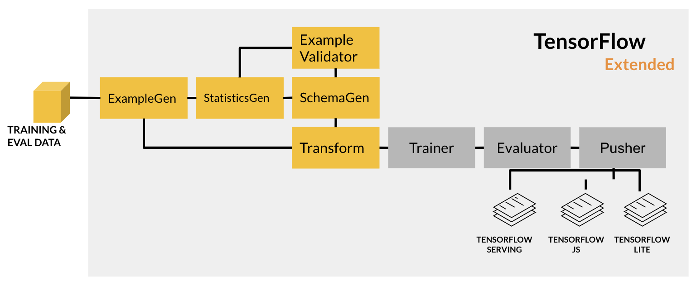

Build up to the feature engineering part. Specifically:

1. ingest data from a base directory with ExampleGen
1. compute the statistics of the training data with StatisticsGen
1. infer a schema with SchemaGen
1. detect anomalies in the evaluation data with ExampleValidator
1. preprocess the data into features suitable for model training with Transform

TFX components that deal with data validation and analysis (i.e. StatisticsGen, SchemaGen, ExampleValidator) uses Tensorflow Data Validation (TFDV) under the hood. 

